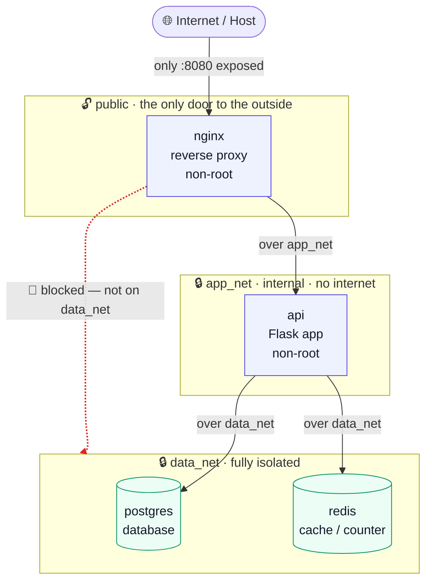

# Cloud-Native Capstone — Hardened Docker → Production-Grade Kubernetes

**English** | [Türkçe](README.tr.md)


[](LICENSE)
[](https://codespaces.new/furkan-akkaya/capstone-docker)

A small `nginx → Flask API → PostgreSQL + Redis` stack, taken from a **security-hardened Docker Compose** deployment all the way to a **production-shaped Kubernetes** deployment — with zero-trust network segmentation, Pod Security Admission, autoscaling, and a GitOps-ready Kustomize layout.

The application is deliberately tiny so the interesting part is the **operational and security engineering around it**, not the business logic.

## Try it live (in your browser)

Click **[Open in GitHub Codespaces](https://codespaces.new/furkan-akkaya/capstone-docker)** — it spins up a full Docker-in-Docker dev container (kubectl + kind preinstalled, `.env` ready). Once it loads:

```bash
make compose-up          # bring up the hardened stack
make verify-isolation    # prove the isolation & hardening controls hold
```

Port `8080` is auto-forwarded, so the running app opens in your browser. No local setup, nothing to host or maintain. For the Kubernetes stage, run `make kind-up`.

---

## The application

Three HTTP endpoints served by Flask + Gunicorn:

| Endpoint    | What it does                                        |
|-------------|-----------------------------------------------------|
| `/health`   | Liveness/readiness signal — `{"status":"ok"}`       |
| `/`         | Increments a **Redis** counter — proves cache wiring |
| `/db-check` | Runs `SELECT 1` on **PostgreSQL** — proves DB wiring |

---

## Architecture

Four services, arranged in three tiers, each tier on its own isolated network. The core idea: **traffic can only move one step inward, never skip a layer.** The internet can reach nginx; nginx can reach the API; only the API can reach the data tier.



*Traffic only moves one step inward. The internet reaches only `nginx`; `nginx` reaches only `api`; and `api` alone can reach the data tier — `nginx` can't even see it.*

### Services (the containers)

| Service    | Role                          | Image                | Runs as     | On networks         | Port | Reachable from host? |
|------------|-------------------------------|----------------------|-------------|---------------------|------|----------------------|
| `nginx`    | Reverse proxy / entry point   | `nginx:1.27-alpine`  | `101:101`   | `public`, `app_net` | 8080 | ✅ yes — `:8080` only |
| `api`      | Flask application             | built from `./api`   | `1000` (`appuser`) | `app_net`, `data_net` | 5000 | ❌ no |
| `postgres` | Database                      | `postgres:16-alpine` | `999:999`   | `data_net`          | 5432 | ❌ no |
| `redis`    | Cache / counter               | `redis:7-alpine`     | `999:999`   | `data_net`          | 6379 | ❌ no |
| `pg-init`  | One-shot volume-permission fixer | `busybox`         | root (exits immediately) | `data_net` | — | ❌ no |

### Networks (the three tiers)

| Network    | `internal`? | Members                          | Purpose |
|------------|-------------|----------------------------------|---------|
| `public`   | no          | `nginx`                          | The **only** network bound to the host. All outside traffic enters here — and nowhere else. |
| `app_net`  | **yes**     | `nginx`, `api`                   | Private link between the proxy and the app. No route to the internet. |
| `data_net` | **yes**     | `api`, `postgres`, `redis`       | Fully isolated data tier. Unreachable from the host *and* from nginx. |

**The key to the whole design:** `api` is the *only* service that sits on both `app_net` and `data_net`. It is the single, deliberate bridge between the app tier and the data tier. `nginx` is **not** on `data_net`, so it can't even resolve `postgres`/`redis` by name — the database is invisible to the layer most exposed to attackers.

### A request's journey

1. A client hits `http://host:8080/` → arrives at **nginx** on the `public` network.
2. nginx proxies the request over **`app_net`** to **`api:5000`**.
3. api talks to **`redis:6379`** and **`postgres:5432`** over **`data_net`** to build the response.
4. The response travels back the same path: api → nginx → client.

The client never sees the database; the database never sees the client. Every hop crosses exactly one network boundary.

---

## Two deployment stages, one codebase

The same four services and the same nginx config, deployed two ways — from a hardened single host to a production-shaped cluster.

### Stage 1 — Hardened Docker Compose

```bash
cp .env.example .env      # then edit POSTGRES_PASSWORD
make compose-up
curl http://localhost:8080/health
```

The three-tier network model above is expressed as three Docker bridge networks, two of them `internal: true`.

### Stage 2 — Kubernetes

Kubernetes is the industry-standard system for running containers at scale — think of it as an orchestra conductor for many machines. Moving here keeps the same security model and adds **self-healing** (a crashed container is replaced automatically), **autoscaling** (more copies spun up under load, fewer when it's quiet), and **zero-downtime updates**.

```bash
# Local, from scratch: creates a kind cluster, builds+loads the image,
# installs ingress-nginx, deploys the dev overlay, and smoke-tests it.
make kind-up

# Or apply to any existing cluster:
kubectl apply -k k8s/overlays/dev     # or overlays/prod
```

The architecture maps cleanly onto Kubernetes primitives:

| Docker Compose            | Kubernetes                                    |
|---------------------------|-----------------------------------------------|
| three isolated networks   | **NetworkPolicies** (default-deny + allow-list) |
| named volume (`pgdata`)   | **PersistentVolumeClaim** (via StatefulSet)    |
| `pg-init` chown container | **`fsGroup`** (kubelet sets volume ownership)  |
| healthchecks              | **readiness / liveness / startup probes**      |
| `depends_on: healthy`     | readiness gating + init ordering               |
| — (host-level only)       | **Pod Security Admission**, HPA, PodDisruptionBudget |

---

## Security posture

*Hardening* means locking each container down so that **even if someone breaks in, there is very little they can do**. The same set of locks is applied in both stages — the table shows the exact settings, and a plain-language explanation follows below it.

| Control                     | Docker Compose                     | Kubernetes                                             |
|-----------------------------|------------------------------------|--------------------------------------------------------|
| Run as non-root             | fixed UIDs (`999`, `101`, `1000`)  | `runAsNonRoot` + explicit `runAsUser` per workload     |
| Drop Linux capabilities     | `cap_drop: ALL`                    | `capabilities.drop: [ALL]`                             |
| No privilege escalation     | `no-new-privileges:true`           | `allowPrivilegeEscalation: false`                     |
| Read-only root filesystem   | `read_only: true` + `tmpfs`        | `readOnlyRootFilesystem: true` + `emptyDir`           |
| Syscall filtering           | Docker default seccomp             | `seccompProfile: RuntimeDefault`                       |
| Enforced at admission       | —                                  | **Pod Security Admission: `restricted`** on the namespace |
| Least-privilege API access  | —                                  | dedicated SA per workload, `automountServiceAccountToken: false` |
| Minimal image               | multi-stage build (no gcc/libpq-dev in final image)                        ||
| Secrets                     | `.env` (gitignored)                | `Secret` refs (swap in Sealed Secrets / ESO / SOPS)    |

**In plain terms — what each lock actually does:**

- **Runs as an ordinary user, not admin** — code inside a container can't reconfigure or take over the host, because it never has admin (root) powers to begin with.
- **Stripped-down permissions** — each container keeps only the bare-minimum system powers it needs; the dangerous ones (raw networking, mounting disks) are removed, and a process can never promote itself to admin through a loophole.
- **Frozen disk** — the container's filesystem is read-only, so an intruder can't drop a malicious file or leave anything behind to survive a restart.
- **Filtered system calls** — the container may only make ordinary requests to the operating system; the rare, dangerous ones used in break-out attacks are blocked.
- **Rules enforced by the cluster itself** (Kubernetes) — the platform refuses to even start a container that violates these rules, so an unsafe one can't ship by accident.
- **No cluster keys in the app** — a hijacked app has no credentials to steal, so it can't turn around and attack the wider system.
- **Minimal image** — the shipped image contains only what's needed to run; there's no compiler or toolset inside for an attacker to abuse.

The exact settings that enforce all of this live in the table above and in the manifests under [`k8s/base/`](k8s/base/) and [`docker-compose.yml`](docker-compose.yml).

### Why the hardening matters — the attacker's perspective

None of this is decoration. Each control answers a concrete attack. The point of
the whole design is **defense in depth**: not "prevent every breach" (impossible),
but make sure that a single compromise doesn't cascade into total loss.

| Control | The attack it defeats |
|---|---|
| **Network segmentation** (postgres/redis on an internal-only tier) | Lateral movement. If an attacker pops the edge (nginx), they still **can't pivot to the database** — the data tier isn't even routable from there. Most real breaches are exactly "perimeter popped → walked to the DB"; this cuts that path. |
| **Run as non-root** | Post-exploitation power. Code execution inside the API container lands as an unprivileged user — it can't read root-owned files, can't bind privileged ports, can't tamper with the OS. |
| **Drop ALL capabilities** | Kernel-level abuse. Even *if* the process were root, `CAP_NET_RAW` (packet sniffing/spoofing), `CAP_SYS_ADMIN` (mounts, many escapes), etc. are gone — so the standard container-escape toolbox mostly doesn't work. |
| **`no-new-privileges`** | Privilege escalation. Defeats the classic "exploit a setuid binary to become root" step — the kernel refuses privilege gains for this process tree. |
| **Read-only root filesystem** | Persistence. An attacker can't drop a webshell, backdoor, or modified binary — the disk won't accept writes. Malware that needs to write to survive simply can't. |
| **Seccomp `RuntimeDefault`** | Container escapes. Dangerous/rare syscalls used by kernel exploits are filtered before they reach the kernel. |
| **Pod Security Admission `restricted`** (K8s) | Malicious/misconfigured manifests. A pod that asks for `privileged`, `hostPath`, or root is **rejected at admission** — the guardrail is enforced by the API server, not left to reviewer discipline. |
| **ServiceAccount token automount off** (K8s) | Cluster takeover. A compromised API pod has **no Kubernetes bearer token to steal**, so it can't enumerate secrets or attack the control plane — closing off a huge class of K8s lateral movement. |
| **Secrets out of git** (`.env` / Sealed Secrets / ESO) | Credential leakage. DB passwords never live in the repo as plaintext. |
| **Minimal multi-stage image** (no compiler, no package manager in the final image) | Living-off-the-land. There's no `gcc`, `apt`, or build toolchain for an attacker to compile an exploit or pull tools with. |
| **Resource requests/limits** (K8s) | Resource-exhaustion DoS & cryptomining. A runaway or hijacked container is capped by cgroups and can't starve its neighbours. |

**Walk the kill chain.** Suppose an attacker finds RCE in the Flask app — the worst realistic starting point:

1. They have a shell — but as **uid 1000, non-root**, with **all capabilities dropped**.
2. They try to escalate via a setuid binary → **blocked by `no-new-privileges`**.
3. They try to drop a persistent backdoor → **read-only filesystem refuses the write**.
4. They try to pivot to the database → nginx can't even see it, and from the API tier they reach **only** postgres/redis on the exact ports allowed — nothing else, and never the internet (default-deny egress).
5. On Kubernetes, they look for a service-account token to attack the cluster → **there isn't one mounted**.

Every step after the initial foothold hits a wall. That's the whole point.

### Zero-trust networking (Kubernetes)

`k8s/base/network-policies.yaml` starts with a **default-deny** on all pods (ingress *and* egress), then opens only the required paths:

```
internet ──▶ nginx :8080 ──▶ api :5000 ──┬─▶ postgres :5432
                                          └─▶ redis    :6379
```

- Every pod can reach **only** DNS by default.
- `postgres` and `redis` accept connections **exclusively from `api`**.
- Nothing in the namespace can egress to the internet.

> Requires a NetworkPolicy-enforcing CNI (Calico / Cilium). kind's default `kindnet` accepts the policy objects but does not enforce them — see the note in `scripts/bootstrap-kind.sh`.

---

## Proof of isolation — verify it yourself

The claims above aren't just asserted; they're checked against the running stack.

```bash
make compose-up
make verify-isolation      # or: ./scripts/verify-isolation.sh
```

The script probes the live containers and fails loudly if any control isn't
actually enforced:

```
1. End-to-end path works (internet → nginx → api → postgres/redis)
  ✔ PASS  /health responds
  ✔ PASS  / responds (redis counter)
  ✔ PASS  /db-check responds (postgres)

2. Data tier is NOT exposed to the host  (defeats: direct DB attack from outside)
  ✔ PASS  postgres 5432 refused from host
  ✔ PASS  redis 6379 refused from host

3. Network segmentation  (defeats: lateral movement after edge compromise)
  ✔ PASS  nginx cannot reach postgres (not on data_net)
  ✔ PASS  nginx cannot reach redis (not on data_net)
  ✔ PASS  api can reach postgres + redis (only it is on data_net)

4. Container hardening on the API  (defeats: privilege escalation & persistence)
  ✔ PASS  api runs as non-root (uid=1000)
  ✔ PASS  api rootfs read-only (cannot drop backdoor)
  ✔ PASS  all Linux capabilities dropped (cap_drop: ALL)
  ✔ PASS  privilege escalation disabled (no-new-privileges)
  ✔ PASS  read-only root filesystem enforced by runtime

Summary: 13 passed, 0 failed
All isolation & hardening controls verified.
```

---

## Supply-chain security (CI)

Runtime hardening protects a *running* container. Supply-chain security protects
**what goes into the image and how it's built** — the other half of the picture.
Every push and pull request (plus a weekly cron) runs:

| Check | Tool | What it catches |
|---|---|---|
| Dockerfile lint | **hadolint** | insecure / inefficient Dockerfile patterns |
| Secret scan | **gitleaks** | credentials accidentally committed to git history |
| Image CVE scan | **Trivy** | known vulnerabilities in the built image → SARIF in the **Security** tab |
| Manifest misconfig scan | **Trivy config** | insecure Kubernetes / Compose / Dockerfile settings |
| Manifest schema validation | **kubeconform** | invalid Kubernetes objects, before they ever reach a cluster |

Plus two habits that matter more than any single scan:

- **Base images pinned by digest** (`image:tag@sha256:…`) — a moving tag can change
  under you; the digest can't. Reproducible, tamper-evident builds.
- **Findings are triaged, not blindly suppressed** — the handful of accepted
  exceptions live in [`.trivyignore`](.trivyignore) *with written justifications*
  (e.g. the database can't use a read-only root filesystem — its engine must write
  to its data directory).

See [`SECURITY.md`](SECURITY.md) for the reporting policy and the full model.

---

## Repository layout

```
.
├── api/                      # Flask app + multi-stage Dockerfile
├── docker-compose.yml        # Stage 1: hardened Compose stack
├── k8s/
│   ├── base/                 # Stage 2: environment-agnostic manifests
│   │   ├── namespace.yaml            # Pod Security Admission: restricted
│   │   ├── serviceaccounts.yaml      # per-workload SA, token automount off
│   │   ├── secret.yaml               # DB creds (demo placeholder)
│   │   ├── postgres.yaml             # StatefulSet + headless Service + PVC
│   │   ├── redis.yaml                # Deployment + Service
│   │   ├── api.yaml                  # Deployment + Service + probes
│   │   ├── nginx.yaml                # Deployment + Service (+ generated ConfigMap)
│   │   ├── nginx.conf                # single source of truth (Compose + K8s)
│   │   ├── ingress.yaml              # cluster-edge entrypoint
│   │   ├── network-policies.yaml     # zero-trust segmentation
│   │   ├── pdb.yaml                  # PodDisruptionBudgets
│   │   └── kustomization.yaml
│   └── overlays/
│       ├── dev/              # 1 replica per tier — laptop / kind
│       └── prod/             # HA replicas + HPA + immutable registry tag
├── kind/                     # local cluster config
├── scripts/
│   ├── bootstrap-kind.sh     # one-command local cluster + deploy
│   ├── teardown-kind.sh
│   └── verify-isolation.sh   # proves the isolation/hardening controls hold
├── .devcontainer/            # one-click GitHub Codespaces environment
├── .github/workflows/
│   ├── ci.yaml               # render + schema-validate every overlay, build image
│   └── security.yaml         # hadolint · gitleaks · Trivy image + config scans
├── .trivyignore              # triaged, justified scan exceptions
├── SECURITY.md               # security policy + threat-model pointer
├── LICENSE
└── Makefile
```

Run `make help` to see every task.

---

## Cloud-native concepts demonstrated

- **StatefulSet + `volumeClaimTemplates`** for the database, with `fsGroup` handling volume ownership — the native replacement for the one-shot `pg-init` chown container the Compose stack needed.
- **Kustomize base + overlays** — one source of truth, environment differences expressed as patches (replicas, autoscaling, image tags). No templating engine, GitOps-ready.
- **Probes** — `startupProbe` guards a slow first boot, then `liveness`/`readiness` take over; traffic is only routed to Ready pods.
- **Horizontal Pod Autoscaler** (prod) — CPU-driven scaling with a scale-down stabilization window.
- **PodDisruptionBudget** — keeps a replica serving through node drains and upgrades.
- **Pod Security Admission (`restricted`)** — hardening enforced at the API server, not just hoped for.
- **NetworkPolicy** — explicit, least-privilege east-west traffic.
- **Immutable, registry-hosted image tags** in prod vs. locally-built `:latest` in dev.

---

## Validate locally (no cluster needed)

```bash
# Render both overlays and schema-check every object
kubectl kustomize k8s/overlays/dev  | kubeconform -strict -summary -ignore-missing-schemas
kubectl kustomize k8s/overlays/prod | kubeconform -strict -summary -ignore-missing-schemas
```

CI runs exactly this on every push and pull request.

---

## Requirements

- **Stage 1:** Docker + Docker Compose
- **Stage 2:** `kubectl`; plus `kind` for a local cluster; `kustomize` + `kubeconform` for offline validation
